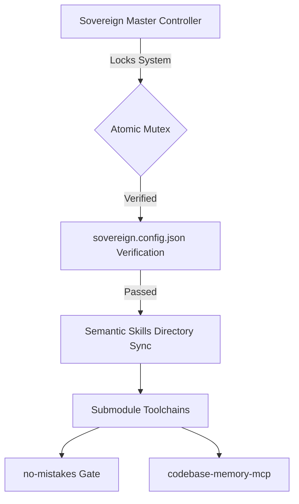

<div align="center">

  <h1>🔱 Sovereign OS <span style="color: #6C5CE7;">v15.0.3-Pure</span></h1>
  <p><strong>A personal PowerShell automation framework that governs how AI coding agents operate across workspaces.</strong></p>

  <p>
    <a href="#"></a>
    <a href="#"></a>
    <a href="#"></a>
  </p>
</div>

---

> [!NOTE]
> **Sovereign OS has been sterilized.** The v15.0.3 release executes the ultimate Ponytail doctrine. The system has been reduced to an absolute minimum of components. There is zero unearned complexity.

## ⚡ The Four Pillars of Sovereign OS

### 1️⃣ Honest Engineering
Features that are described as working must be working. Silent degradation and mock features masquerading as production code are forbidden. One source of truth per fact.

### 2️⃣ Absolute Minimalism (The Ponytail Doctrine)
Zero bloat. Abstractions and wrapper scripts are violently pruned. The OS consists solely of a single Master Controller script (`sovereign.ps1`), a minimalistic configuration (`sovereign.config.json`), and raw Semantic Skills (`skills/`).

### 3️⃣ Semantic Execution & Embedded Modules
Agentic workflows are no longer driven by brittle PowerShell module wrappers. They are driven entirely by raw Markdown skills that agents parse and execute autonomously. 
Crucially, external intelligence tools (such as **no-mistakes** for PR Gating and **codebase-memory-mcp** for contextual graphing) are embedded directly into Sovereign OS as isolated **Git Submodules** under `skills/ponytail/modules/`. This guarantees full functionality with zero global pollution.

### 4️⃣ OS-Level Mutex Locking
The system safely guards the workspace by establishing an OS-level file lock, ensuring no concurrent operations can corrupt the environment.

---

## 🏗️ System Architecture



---

## 🚀 Ignition

> [!WARNING]
> Ignition locks the execution environment. All external drift is blocked via an OS-level file stream lock.

To boot the Sovereign Master Controller:

```bash
pwsh -ExecutionPolicy Bypass -File "C:/Skills/sovereign.ps1"
```

To update the integrated tools (no-mistakes & codebase-memory-mcp) from their upstream repositories:
```bash
git submodule update --remote
```

---

<div align="center">
  <h3>Autonomously governed by the Sovereign Execution Engine.</h3>
  <p><i>"Small, correct, honest, and verified."</i></p>
</div>
