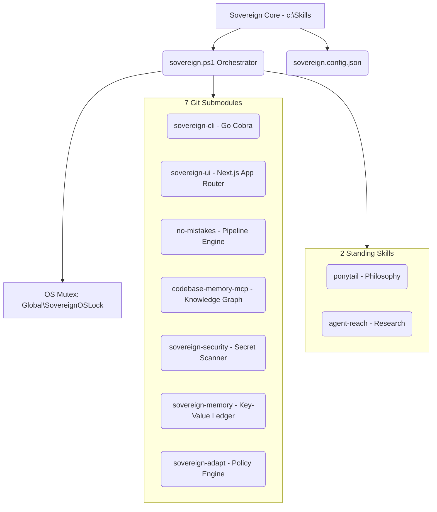

# ⚡ Sovereign-OS V17 — Pristine Agent Governance Architecture


> **Sovereign-OS** is a hyper-minimalist meta-framework engineered for governing autonomous AI coding agents across projects. Operating strictly on the **Ponytail Doctrine** (deletion before addition, zero unearned complexity, concrete utility), it delivers single-instance OS mutex lock guarantees, dynamic asset discovery, and seamless submodule orchestration.

---

## 🌐 Documentation & Web Portal

Visit the redesigned GitHub Pages documentation portal:
👉 **[Sovereign-OS Interactive Documentation Hub](https://tejaswin-amara.github.io/Sovereign-OS/docs/index.html)**

### Documentation Navigation
- 🏛️ **[System Architecture](docs/architecture.md)** — OS Mutex locking, topology & state synchronization.
- 📦 **[Submodules Reference](docs/modules.md)** — Specifications for all 7 decoupled submodules.
- ✂️ **[Agent Skills Guide](docs/skills.md)** — Deep dive into `ponytail` minimalism and `agent-reach` research.
- 📐 **[Types Reference](docs/types.md)** — Type definitions across TypeScript, Go, and JSON schemas.
- 💻 **[CLI Reference](docs/cli.md)** — PowerShell orchestrator & CLI command parameters.
- 🔒 **[Security Policy](docs/security.md)** — Zero-trust secret scanner & credential redaction rules.

---

## 🏛️ System Architecture



---

## 📦 Submodules Matrix

| Submodule | Category | Stack | Purpose |
| :--- | :--- | :--- | :--- |
| **[`sovereign-cli`](modules/sovereign-cli)** | CLI | Go (Cobra / Viper / Zap) | Command-line control & system state querying |
| **[`sovereign-ui`](modules/sovereign-ui)** | Frontend | Next.js 14 / TypeScript / Tailwind | Real-time web telemetry & agent status dashboard |
| **[`no-mistakes`](modules/no-mistakes)** | Pipeline | Go | Automated git safety, PR routing & verification gates |
| **[`codebase-memory-mcp`](modules/codebase-memory-mcp)** | Knowledge Graph | C / Node.js MCP | Semantic code search, Cypher graph & path tracing |
| **[`sovereign-security`](modules/sovereign-security)** | Security | Go | Zero-trust secret scanner & static security audit |
| **[`sovereign-memory`](modules/sovereign-memory)** | State | Go | Key-value memory ledger & persistent execution store |
| **[`sovereign-adapt`](modules/sovereign-adapt)** | Policy | Go | Strategy tuning & auto-remediation policy engine |

---

## 🚀 Quickstart

Run the single PowerShell orchestrator to perform OS mutex locking, dynamic module discovery, and telemetry logging:

```powershell
# Execute the Sovereign-OS Orchestrator
powershell -ExecutionPolicy Bypass -File .\sovereign.ps1
```

### Sample Terminal Output
```text
[00:04:46] [INFO] [MUTEX] OS-Level Lock Acquired.
[00:04:46] [INFO] [INIT] Dynamic skill count: 2, Module count: 7
[00:04:46] [INFO] [COMPLETE] ALL PHASES PASSED
[00:04:46] [INFO] [MUTEX] Lock released.
[00:04:46] [INFO] [TELEMETRY] Execution finished in 178 ms.
```

---

## 📜 The Ponytail Doctrine

1. **Deletion Before Addition**: Unused code is technical debt. Prune dead code, unused dependencies, and speculative fallbacks.
2. **Zero Unearned Complexity**: Only build what is requested and currently useful.
3. **Verifiable System State**: Every capability must be backed by empirical test logs or build output.

---

## ⚖️ License & Governance

Bound by the Standing Directive at `.agents/AGENTS.md` and certified in `AUDIT_LEDGER.md`.
Distributed under the MIT License.
