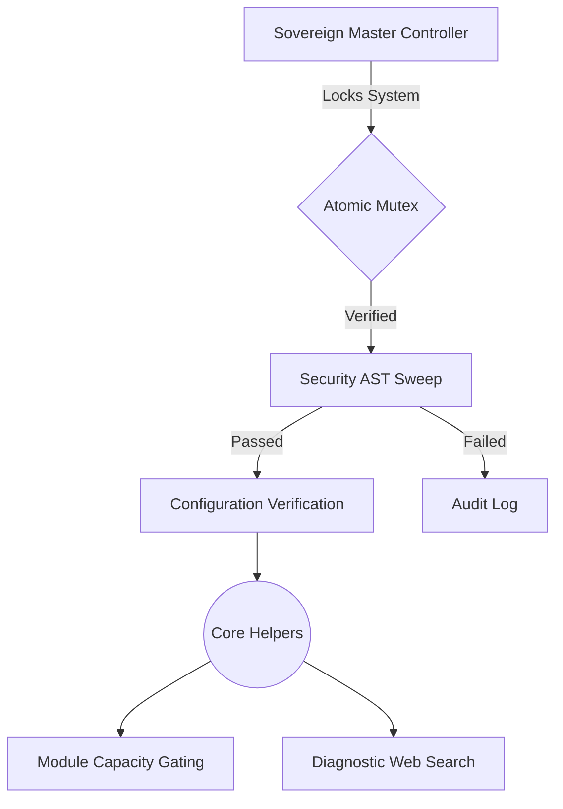

<div align="center">

  <h1>🔱 Sovereign OS <span style="color: #6C5CE7;">v15.0.0-CloudNative</span></h1>
  <p><strong>A personal PowerShell automation framework that governs how AI coding agents operate across workspaces.</strong></p>

  <p>
    <a href="https://github.com/tejaswin-amara/Sovereign-OS/actions"></a>
    <a href="#"></a>
    <a href="#"></a>
  </p>
</div>

---

> [!NOTE]
> **Sovereign OS has been rebuilt.** The v15.0.0 release is a ground-up reconstruction focused on "Honest Engineering". Aspirational mock features (eBPF, ZK-SNARKs, Algorand ledgers) have been surgically removed in favor of real, working automation.

## ⚡ The Four Pillars of Sovereign OS

### 1️⃣ Honest Engineering
Features that are described as working must be working. Silent degradation and mock features masquerading as production code are forbidden. One source of truth per fact.

### 2️⃣ Configuration Integrity
The system's configuration is managed through `sovereign.config.json` and cryptographically sealed using cross-platform DPAPI/Fallback checksums to prevent manual tampering and drift.

### 3️⃣ Mass Deployment Optimization
Designed for seamless integration into agent workspaces.
- **The Ponytail Doctrine:** Zero bloat. Abstractions and wrapper scripts are violently pruned.
- **Cross-Platform Parity:** Works flawlessly on Windows, Linux, and Docker environments.

### 4️⃣ Continuous Diagnostics & Evolution
- **Diagnostic Fallback:** The system automatically invokes `Invoke-SovereignInternetDiagnostic` to search the web for solutions to runtime exceptions.
- **Drift Analysis:** Internal intelligence is recorded via `evolution_report.md` and fed back into `self-evolve.ps1`.

---

## 🏗️ System Architecture



---

## 🚀 Ignition

> [!WARNING]
> Ignition locks the execution environment. All external drift is blocked via an OS-level file stream lock.

To boot the Sovereign Master Controller:

```bash
pwsh -ExecutionPolicy Bypass -File "C:/Skills/sovereign.ps1" -ProjectPath "$PWD"
```

---

<div align="center">
  <h3>Autonomously governed by the Sovereign Execution Engine.</h3>
  <p><i>"Small, correct, honest, and verified."</i></p>
</div>
