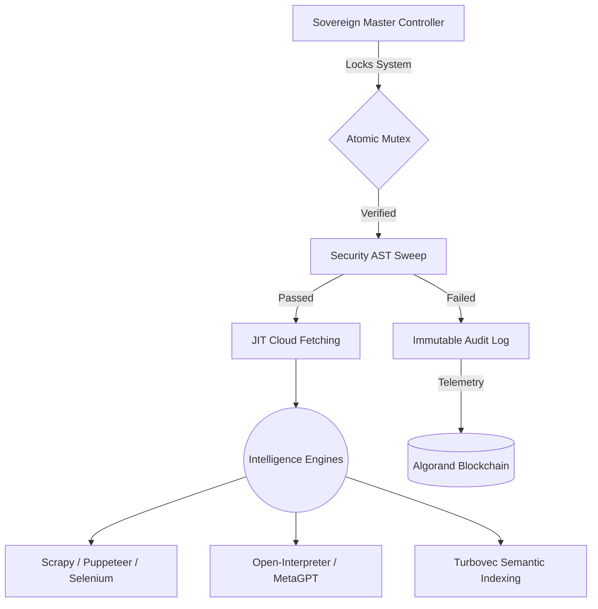

<div align="center">

  <h1>🔱 Sovereign OS <span style="color: #6C5CE7;">v14.0.0-CloudNative</span></h1>
  <p><strong>The ultra-optimized, autonomous execution environment for Privacy-Preserving Federated Learning (PPFL).</strong></p>

  <p>
    <a href="https://github.com/tejaswin-amara/Sovereign-OS/actions"></a>
    <a href="#"></a>
    <a href="#"></a>
    <a href="#"></a>
  </p>
</div>

---

> [!NOTE]
> **Sovereign OS Abandons the monolithic edge.** It is a strictly governed, self-evolving swarm architecture designed exclusively around absolute execution guarantees, zero drift, and maximum intelligence aggregation.

## ⚡ The Four Pillars of the Sovereign Swarm

### 1️⃣ Maximum Resource Exploitation
Agents do not rely solely on static code. They are authorized to dynamically fetch, compile, and execute tools from GitHub and local repositories using **JIT Cloud Fetching** (`Fetch-CloudSkill.ps1`). The OS integrates external skills seamlessly to maximize execution speed and output quality.

### 2️⃣ Omni-Reach (Internet Autonomy)
The system possesses frictionless access to the global internet. Autonomous subagents utilize MCPs and GitHub APIs to crawl, scrape, and extract intelligence flawlessly with zero human intervention.
- **Core Automation Engines:** Fully integrated local copies of `Playwright`, `Puppeteer`, `Scrapy`, `Selenium`, `Open-Interpreter`, `MetaGPT`, and `AutoGen` for programmatic web automation.

### 3️⃣ Mass Deployment Optimization
Designed for mass IoMT deployment, Sovereign OS is optimized to the absolute limit.
- **The Ponytail Doctrine:** Zero bloat. Abstractions and wrapper scripts are violently pruned.
- **Micro-Singularity:** Payloads compile to WASM or raw binaries. Ephemeral edge sandboxes (`tmpfs`) are instantly annihilated post-execution to guarantee a pristine disk footprint.

### 4️⃣ Continuous Evolution & Immutable Logging
The system continuously self-corrects and records its state.
- **Evolution Engine:** Internal intelligence is recorded via `evolution_report.md` and fed back into `self-evolve.ps1`.
- **Layer-1 Telemetry:** Security quarantines and drift anomalies are immutably written to the Algorand blockchain as 0-value Transaction Notes via native REST calls.

---

## 🏗️ System Architecture



---

## 🚀 Ignition

> [!WARNING]
> Ignition locks the execution environment. All external drift is blocked via an OS-level file stream lock.

To boot the Sovereign Master Controller:

```bash
pwsh -ExecutionPolicy Bypass -File "C:/Skills/sovereign.ps1" -ProjectPath "$PWD"
```

---

<div align="center">
  <h3>Autonomously governed by the Antigravity Sovereign Execution Engine.</h3>
  <p><i>"Zero safeguards. Zero intervention. Absolute mathematical precision."</i></p>
</div>
