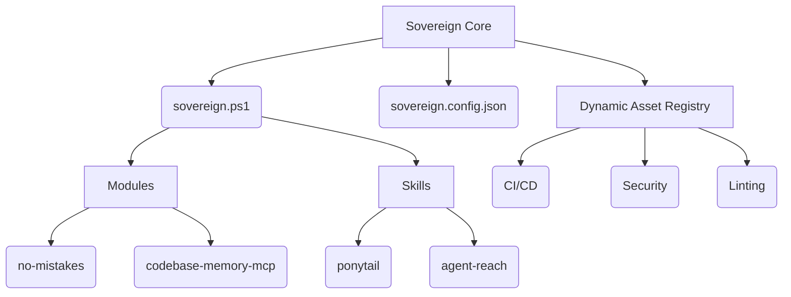

# Sovereign-OS (V16 Pristine)

Sovereign-OS is a hyper-minimalist meta-framework for governing autonomous AI coding agents across projects. Built strictly on the Ponytail doctrine, it provides exactly what is needed to manage agents and absolutely nothing more.

## Architecture

At its core, Sovereign relies on a single PowerShell orchestrator (`sovereign.ps1`) that enforces single-instance execution via an OS-level Mutex and manages configuration via `sovereign.config.json`. 

The system's capabilities are derived entirely from Git Submodules and the Dynamic Asset Registry.

## The Dynamic Asset Registry
Sovereign-OS does not vendor large external dependencies (like CI/CD pipelines, security scanners, or frontend frameworks) by default. Instead, it maintains a curated `ASSET_REGISTRY.md`. 

Agents operating within Sovereign-OS read this registry and dynamically integrate tools using `agent-reach` only when a user task actively requires them. This ensures the core repository remains pristine and unbloated.

## Governance
All operations within Sovereign-OS are bound by the Standing Directive located at `.agents/AGENTS.md` and the philosophical constraints of the `ponytail` skill. Proof of system integrity is strictly documented in `AUDIT_LEDGER.md`.
