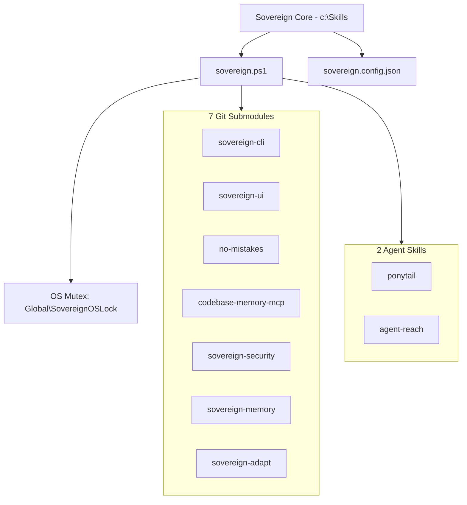

# Sovereign-OS V17 — Architecture Specification

## Overview

Sovereign-OS is a hyper-minimalist meta-framework designed to govern autonomous AI coding agents across projects. Built strictly on the **Ponytail Doctrine** (deletion before addition, zero unearned complexity, concrete utility over speculative features), it provides execution lock synchronization, dynamic asset management, and modular submodule structure.

---

## System Topology



---

## Core Components

### 1. PowerShell Orchestrator (`sovereign.ps1`)
- **OS Mutex Lock**: Uses `System.Threading.Mutex` (`Global\SovereignOSLock`) wrapped in `try ... finally` to guarantee single-instance execution across processes.
- **Dynamic Discovery**: Scans `modules/` and `skills/` directories on every invocation and updates `sovereign.config.json` atomically.
- **Telemetry**: Measures execution latency in milliseconds and records metrics without bloating local storage.

### 2. Configuration Store (`sovereign.config.json`)
Atomic JSON configuration mapping system state, active submodules, enabled skills, and audit signatures.

### 3. Submodule Architecture (7 Modules)
Isolated Git submodules providing specialized capabilities:
- `sovereign-cli`: Go Cobra/Viper CLI
- `sovereign-ui`: Next.js App Router UI
- `no-mistakes`: Pipeline & PR Engine
- `codebase-memory-mcp`: Knowledge Graph MCP Server
- `sovereign-security`: Zero-Trust Secret Scanner
- `sovereign-memory`: Persistent Key-Value Ledger
- `sovereign-adapt`: Remediation & Tuning Engine

---

## Concurrency & Mutex Semantics

To prevent multi-agent race conditions or corrupted configuration writes, `sovereign.ps1` implements OS-level locking:

```powershell
$Mutex = New-Object System.Threading.Mutex($false, "Global\SovereignOSLock")
if (-not $Mutex.WaitOne(5000)) {
    Write-Error "Could not acquire Sovereign OS Mutex lock within 5000 ms."
    exit 1
}
try {
    # Perform atomic initialization & discovery
} finally {
    $Mutex.ReleaseMutex()
}
```
